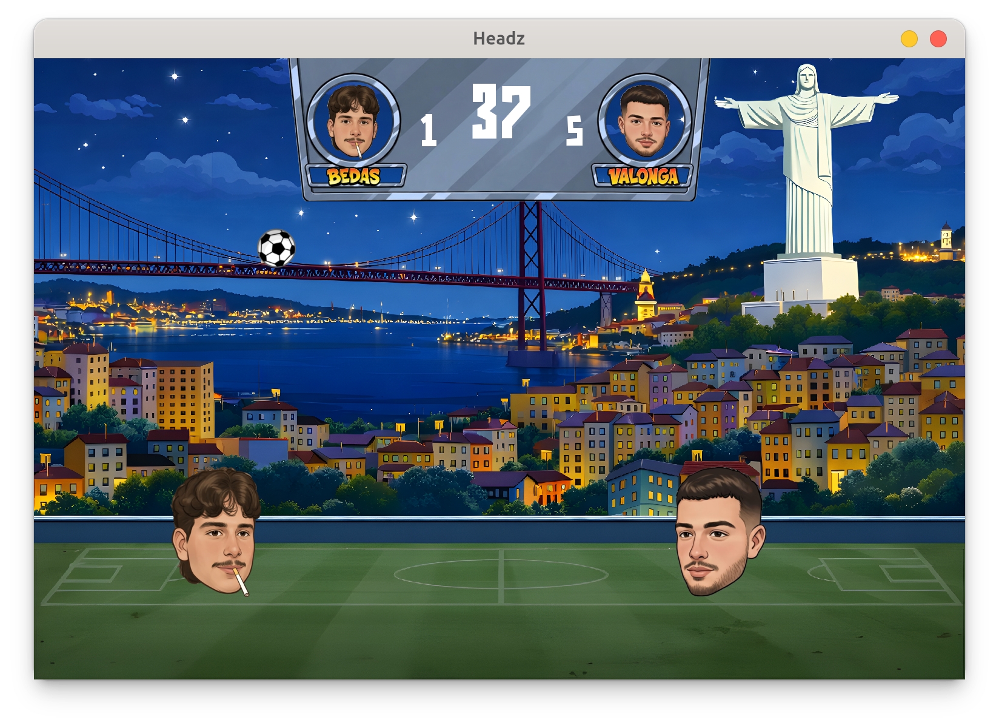

# Headz

A 2D football game built with Python and Pygame, inspired by head soccer.

> [!NOTE]
> Headz is currently a **Work in Progress (WIP)**.
> This project was created to practice Python, OOP and game development, so expect lower quality and some bugs.

